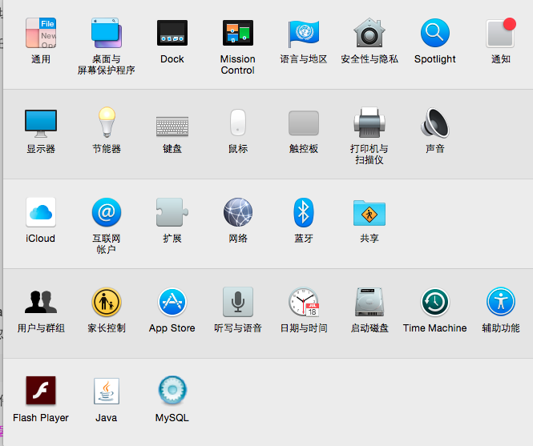

#  在mac安装MySQL数据库

## 1.在网上找了一篇教程

[mac安装mysql的两种方法（含配置）](http://www.jianshu.com/p/fd3aae701db9)

## 2.在这篇文章底部找到作者发布的mysql的百度云地址，点进去就能下载

[mysql百度云地址](https://pan.baidu.com/s/1slJAgqh)


## 3.安装好后，点击桌面顶部左侧的苹果图标，点开“系统偏好设置”，看到底下有“mysql”的图标就是安装成功了。



## 4.点击这个mysql的图标，开启mysql服务


## 5、此时需要配置环境变量（失败）

1.在终端输入以下语句，并查看有没有mysql

```
cd /usr/local/mysql/bin
```


2.执行vim ~/.bash_profile会出现以下界面

```
vim ~/.bash_profile
```


3.接下来用mysql -u root -p 却发现登陆不了


## 6.重置密码(失败)

1.在终端里输入这几句

```
cd ~
touch .bash_profile
open -e .bash_profile

```


就会跳出一个文件


在这个文件加入这么一句代码

```
export PATH=${PATH}:/usr/local/mysql/bin
```

保存并**退出终端**，然后发现还是登陆不了mysql

## 7.重置密码

1.停止mysql服务


2.在第一个终端输入```sudo /usr/local/mysql/bin/mysqld_safe --skip-grant-tables``` ,再输入本机的密码


3.在第二个终端里输入```sudo /usr/local/mysql/bin/mysql -u root```，再输入本机密码


4.接着在输入命令```UPDATE mysql.user SET authentication_string=PASSWORD('新密码') WHERE User='root'```，回车，如果出现以下界面，说明修改成功


5.再输入```FLUSH PRIVILEGES;```,回车，出现下面界面为成功


6.最后输入```\q```，退出，关闭终端，回到系统偏好设置，重新开启mysql就可以使用了。


